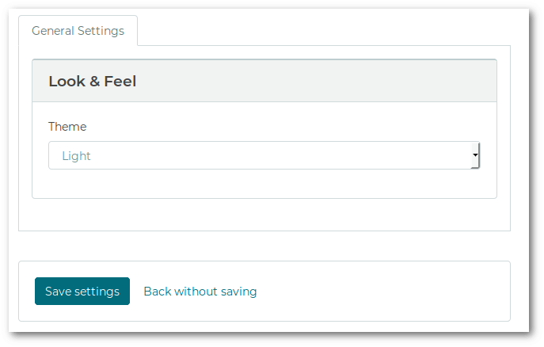

# Building UI

## Tree

Gears has a set of classes that help building the UI for managing settings.

A common approach is to display a page/window for the users that contains all the settings organized
into a tree or a tree-like nodes like menus, tabs, groups.

A **Tree** contains nodes and items:

```
Tree
│
└─> Node
    │
    └─> Node
        │
        └─> Item
            │
            └─> Widget
            └─> Preference||Setting
            └─> Value
```

**Tree Nodes** are used for grouping setttings/preferences and are represented in the UI as menus,
tabs, groups, collapsible accordions, etc.

**Tree Items** contain one setting/preference + definition of their widget and are represented
in the UI as controls (label + edit, checkbox, dropdown, etc).

## Tree Builder

The `TreeBuilder` class simplifies creating the setting tree.

```php
use Konekt\Gears\UI\TreeBuilder;

$builder = new TreeBuilder(app('gears.settings'), app('gears.preferences'));

$builder->addRootNode('general', 'General Settings');
// Add a child node below 'general':
$builder->addChildNode('general', 'looknfeel', 'Look & Feel');
$builder->addPreferenceItem('looknfeel', ['select', ['label' => __('Theme')]], 'app.theme');

// To get the tree:
$preferencesTree = $builder->getTree();
```

## Rendering The Tree

The rendering of the tree is being done by your application.

> In this example, the top level nodes of the tree are displayed as tabs, and second level nodes as cards

**The Component:**

```blade
<!-- select.blade.php -->
<label class="form-control-label">{{ $label }}</label>
<div class="form-group">
    <select class="form-control" name="{{ $name }}">
    @foreach($options as $key => $label)
        <option value="{{ $key }}" @if($key == $value) selected @endif>{{ $label }}</option>
    @endforeach
    </select>
</div>
```

**The Form:**

```blade
<div class="tab-content">
@foreach($preferencesTree->nodes() as $tab)
    <div id="{{ $tab->id() }}" class="tab-pane{{ $loop->first ? ' active show' : '' }}" role="tabpanel">
        @foreach($tab->children() as $card)
            <div class="card">
                <div class="card-header">
                    {{ $card->label() }}
                </div>
                <div class="card-block">
                    @foreach($card->items() as $item)
                        @component($item->getWidget()->component(),
                            array_merge([
                                'name'    => sprintf('preferences[%s]', $item->getKey()),
                                'value'   => $item->getValue(),
                                'options' => $item->getPreference->options()
                            ], $item->getWidget()->attributes())
                        )
                        @endcomponent
                    @endforeach
                </div>
            </div>
        @endforeach
    </div>
@endforeach
</div>
```

**Result:**




**Next**: [Examples &raquo;](examples.md)
